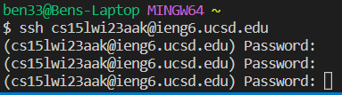

# CSE 15L Week 1 Lab Report: Remote Access

By Benjamin Johnson

## Contents

### [Overview](#overview-1)

### [Installing VS Code](#installing-vs-code-1)

### [Remotely Connecting](#remotely-connecting-1)

### [Trying Some Commands](#trying-some-commands-1)

### [Remotely Copying Files](#remotely-copying-files-1)

## Overview

In CSE 15L, we're learning how to interact with a computer through the command line. If you want to run commands on another computer, such as the lab computers in UCSD's CSE basement, you must connect to that computer using a tool called `ssh`. In week 1 of CSE 15L, we learned how to use ssh to connect to our accounts on the CSE basement computers.

## Installing VS Code

Visual Studio Code, or VS Code, is a text editor which can be used to edit text and other files, but also comes with tools to manage writing and running code. For this lab, we used VS Code's terminal to run commands and remotely connect over ssh.

You can download VS Code [here](https://code.visualstudio.com/). Once you download it, run the installer, and open it, you should see a screen like this one:


From there, you can open a terminal by clicking "Terminal" at the top, and then "New Terminal". This is what my bash terminal looks like on my personal laptop:


## Remotely Connecting

Now that I have a terminal open, I can connect to my account on the CSE basement computers server using ssh.

The syntax for the ssh command is:

```
ssh <username>@<server>
```

where \<username> is your username on a server and \<server> is the address of the server you're connecting to. For me, my username is `cs15lwi23aak` and the server address is `ieng6.ucsd.edu`. So the full command would be `ssh cs15lwi23aak@ieng6.ucsd.edu`. After running this command, I'm prompted to put in my password:


This is the output after typing in my password:


For any student in CSE 15L this quarter, your username would be `cs15lwi23<code>` where \<code> is a 2- or 3-letter code specific to you. You can access this code [here](https://sdacs.ucsd.edu/~icc/index.php).

If you type your password incorrectly, the terminal will keep prompting ou for your password until you type it correctly, as you can see:



To disconnect from the ssh server, simply type `exit`:


## Trying Some Commands

After connecting to the ssh server, I'll try some commands to learn about and experiment with the files on my account. First, `ls` to list all files and directories:


Next, `pwd` to print my working directory (the directory my terminal is in after connecting via ssh):


Since the only directory I found with `ls` was `perl5`, let's use `cd perl5` to move into that directory:


Now, if I use `ls` to list all files and directories, I'll see some files I've prepared in advance (the first time I connected via ssh, this directory was empty):


I can use `cat testfile.txt` to print the contents of the `testfile.txt` text file to the terminal:


I can use `cp testfile.txt testfile2.txt` to copy the contents of `testfile.txt` to another textfile in the same directory named `testfile2.txt`:


I can use `ls` and `cat testfile2.txt` to verify that the file was created:


## Remotely Copying Files

I can use commands like `cp`, `nano`, `rm`, etc., to edit and move files on my local computer or on the ssh server, but what if I want to move files between them? For that, I can use `scp`, which stands for `secure copy`. The syntax is similar to cp:

```
scp <existing-file-path> <new-file-path>
```

You run scp locally, and can provide the address of the ssh server followied by an absolute path when specifying remote files.

For example, after logging out of ssh, I can copy the `testfile.txt` to my local using scp (the dot means to copy it into my working directory):


I can use `cat testfile.txt` to verify that the file was copied to my local working directory:


I can copy the file back to the remote ssh server. First, I cp it locally to a file named `testfile-from-local.txt`, then I scp that to the server:


Then, after using ssh to log into the server, I can use `ls` and `cat testfile-from-local.txt` to verify that the file was copied from local:


