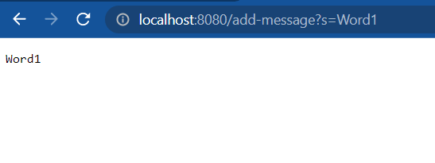

# CSE 15L Week 3 Lab Report: Servers and Bugs

By Benjamin Johnson

## Contents

### [Part 1: StringServer](#part-1-stringserver-1)

### [Part 2: Bugs, Symptoms, and Failure-inducing Output](#part-2-bugs-symptoms-and-failure-inducing-output-1)

### [Part 3: Reflection](#part-3-reflection-1)

## Part 1: StringServer

### Background: Web Servers

Last week in CSE 15L, we learned about web servers. A web server is a program that listens for reqeusts to a certain domain, and responds with a webpage for users to see in their browser.

We learned how to write web servers in Java, using Java's URI (uniform resource identifier) and HTTP (hyper-text transfer protocol, the protocol for sending web requests and responses) libraries. In lab, we were given a Java file called Server, with classes for running a web server. The `URLHandler` is an interface describing an object that can receive requests to different paths and respond with the desired response. The `ServerHttpHandler` class is a class to call a URLHandler, serialize and write its response as an HTTP response, and handle errors. The `Server` class uses HttpServer to start a server on a certain port and listen for requests. This is the source code of that file:

```java
// A simple web server using Java's built-in HttpServer

// Examples from https://dzone.com/articles/simple-http-server-in-java were useful references

import java.io.IOException;
import java.io.OutputStream;
import java.net.InetSocketAddress;
import java.net.URI;

import com.sun.net.httpserver.HttpExchange;
import com.sun.net.httpserver.HttpHandler;
import com.sun.net.httpserver.HttpServer;

interface URLHandler {
    String handleRequest(URI url);
}

class ServerHttpHandler implements HttpHandler {
    URLHandler handler;
    ServerHttpHandler(URLHandler handler) {
      this.handler = handler;
    }
    public void handle(final HttpExchange exchange) throws IOException {
        // form return body after being handled by program
        try {
            String ret = handler.handleRequest(exchange.getRequestURI());
            // form the return string and write it on the browser
            exchange.sendResponseHeaders(200, ret.getBytes().length);
            OutputStream os = exchange.getResponseBody();
            os.write(ret.getBytes());
            os.close();
        } catch(Exception e) {
            String response = e.toString();
            exchange.sendResponseHeaders(500, response.getBytes().length);
            OutputStream os = exchange.getResponseBody();
            os.write(response.getBytes());
            os.close();
        }
    }
}

public class Server {
    public static void start(int port, URLHandler handler) throws IOException {
        HttpServer server = HttpServer.create(new InetSocketAddress(port), 0);

        //create request entrypoint
        server.createContext("/", new ServerHttpHandler(handler));

        //start the server
        server.start();
        System.out.println("Server Started! Visit http://localhost:" + port + " to visit.");
    }
}
```

### The Task

My task for this lab was to create a web server called `StringServer` that would maintain a list of strings that could be added to and read from. Specifically, users can add a new string to the list by visiting the route `/add-message?s=[message]`, where [message] is whatever string they want to add to the list. After adding that string to the list, the server will respond with a list of all strings in the list, each on its own line.

### My Code

```java
class StringServerHandler implements URLHandler {
    String[] messages;
    int messageCount;

    public StringServerHandler() {
        messages = new String[100];
        messageCount = 0;
    }

    String[] getMessages() {
        String[] result = new String[messageCount];
        for (int i = 0; i < messageCount; i++) {
            result[i] = messages[i];
        }
        return result;
    }

    void addMessage(String message) {
        if (messageCount == messages.length - 1) {
            String[] newMessages = new String[messages.length * 2];
            for (int i = 0; i < messages.length; i++) {
                newMessages[i] = messages[i];
            }
            messages = newMessages;
        }
        messages[messageCount] = message;
        messageCount++;
    }

    public String handleRequest(URI url) {
        if (url.getPath().equals("/add-message")) {
            String[] parameters = url.getQuery().split("=");
            if (parameters.length < 2 || !parameters[0].equals("s")) {
                return "Must specify word to add (e.g. /add-message?s=word";
            }
            addMessage(parameters[1]);
        }

        return String.join("\n", getMessages());
    }
}

public class StringServer {

    public static void main(String[] args) throws IOException {
        if (args.length == 0) {
            System.out.println("Missing port number! Try any number between 1024 to 49151");
            return;
        }

        int port = Integer.parseInt(args[0]);

        Server.start(port, new StringServerHandler());
    }
}
```

My code is located in a file called `StringServer.java` and can be compiled with `javac StringServer.java Server.java` and run with `java StringServer [port]`, where [port] is the port number to run the server on (it must be between 1024 and 49151).

I created a class named `StringServerHandler` that implements the `URLHandler` interface, allowing my class to be used with the Server classes to handle HTTP requests. In this class, I had 2 instance variables: `messages`, an array of Strings to track the messages that users input, and `messageCount`, an integer to track how many messages have been submitted. I chose to use a simple array rather than an ArrayList because it was easier to join the array together and display it, but there are many alternative data structures to solve this problem, including an ArrayList, a LinkedList, a SQL or no-SQL database, and a HashSet.

### Methods

When this class is instantiated, `messages` is set to an array of 100 Strings; I chose to do this to avoid having to constantly resize the array at first.

The `getMessages` method returns a new array consisting of the messages in `messages`, but without empty `null` spaces. For example, if `messages` initially has a length of 100 and then you add 5 strings to it, then `getMessages` would return an array of length 5, with only those 5 messages. This method is used for getting the messages to use to respond to web requests.

The `addMessage` method adds a message to the array of messages. It does this by doubling the size of the array if necessary, then adding the new message into the array after the other elements. For example, if the messages array has a length of 100 but only 7 messages, then a new message would become the 8th element.

The `handleRequest` method handles browser requests based on the URL path that was requested. If a user visits the `/add-message` path, with a query parameter named `s` for the message to add, then that message will be added to the array of messages using `addMessage`. If a user visits this path without supplying a query parameter, the response tells them that they must specify the parameter for the word to add. Regardless of the path the user visits, the server responds with a newline-separated list of messages that have been added, calling `getMessages` and then joining the array of messages with newline characters. I chose to return this response on all paths so that users could see the messages by visiting the root path, but an alternative approach would be to return a `404 Not Found` respnse to paths that aren't `/` or `add-message`.

### Screenshots of Using the Server

The first screenshot is of me visiting the path `/add-message?s=Word1`:



Prompts and Answers:

Which methods in your code are called?

1. The first method to be called (apart from the behind-the-scenes handling methods in Server and Java's Http libraries) is `handleRequest`.

2. Second, because the URL path is `add-message` and a valid query is supplied, the `addMessage` method is called.

3. Finally, the `getMessages` method is called to get all messages.

What are the relevant arguments to those methods, and the values of any relevant fields of the class?

1. For `handleRequest`, the `url` argument is `/add-message?s=Word1` (I was curious about whether the domain, `localhost:8080`, was part of the `url` string, so I tested by having my `handleRequest` method print the value of `url` at the beginning, and it turns out this argument only includes the path, not the domain or port). At this point, the `messages` instance variable is a String array of `null`s, and messageCount is 0.
2. For `addMessage`, the `message` argument is "Word1" because `handleRequest` takes the value of the `s` query parameter and supplies it as an argument to `addMessage`. Before this method call, `messageCount` is a String array of 100 `null`s, and messageCount is 0. After this method call, `messages` is a String array of "Word1" followed by 99 `null`s, and `messageCount` is 1.
3. For `getMessages`, there are no arguments, and `messages` is a String array of "Word1" followed by 99 `null`s, and `messageCount` is 1.

How do the values of any relevant fields of the class change from this specific request? If no values got changed, explain why.

- This request changes `messages` by putting "Word1" as the first element in `messages` and changing `messageCount` from 0 to 1 to indicate that there is now 1 message.

The second screenshot is of me visiting the path `/`, after having added "Word1", "Word2", and "Word3" to the `messages` array:


Prompts and Answers:

Which methods in your code are called?

1. The first method to be called (apart from the behind-the-scenes handling methods in Server and Java's Http libraries) is `handleRequest`.

2. Second, `getMessages` method is called to get all messages (`addMessage` is not called this time because no query parameter is supplied).

What are the relevant arguments to those methods, and the values of any relevant fields of the class?

1. For `handleRequest`, the `url` argument is `/` At this point, the `messages` instance variable is "Word1", "Word2", "Word3", and then 97 null`s, and messageCount is 3.
2. For `getMessages`, there are no arguments. `messages` is "Word1", "Word2", "Word3", and then 97 null`s, and messageCount is 3.

How do the values of any relevant fields of the class change from this specific request? If no values got changed, explain why.

- This request does not change any of the instance variables tracking the messages because it only retrieves those messages, it doesn't add a new one (and adding a new message is the only way my code has to change the instance variables).

## Part 2: Bugs, Symptoms, and Failure-inducing Output

This week in CSE 15L, we learned about bugs and how to identify and fix bugs. For this week's lab, we were given several programs with bugs in them, and needed to catch and fix the bugs by using JUnit, a unit testing framework in Java.

The buggy program I chose for this report is `LinkedListExample.java`, which is an implementation of a Linked List that has a bug in the `append` method.

- Failure-inducing input: I wrote this JUnit test to induce failure in the buggy `append` method:

```java
 @Test
    public void testAppendMultipleTimes() {
        LinkedList list = new LinkedList();
        list.append(1);
        list.append(2);
        list.append(3);
        assertEquals(3, list.last());
        assertEquals(1, list.first());
    }
```

- An input that doesn't induce a failure:

```java
    @Test
    public void testAppendOnce() {
        LinkedList list = new LinkedList();
        list.append(1);
        assertEquals(1, list.last());
        assertEquals(1, list.first());
    }
```

- Symptom (result of running tests):

For the failure-inducing input: The program freezes for several minutes, then throws an `OutOfMemoryError`:


For the input that doesn't induce failure: The program runs the test with no errors and JUnit says it is "Ok":


- Bug: The bug in the program is that the `append` method continually traverses the list and sets the current node's next node to the node that is being appended. This means that the program constantly appends that node and never reaches `null`, which is the condition for its loop to terminate. The input of only appending to the list one time does not induce this failure because there is a special case in the method to handle when the list is empty, which is the case before the first time it is appended to.

The fix for the bug is take the line that sets the current node's next node to the new node, and move it after the while loop instead of inside it.

Before:

```java
while(n.next != null) {
    n = n.next;
    n.next = new Node(value, null);
}
```

After:

```java
while(n.next != null) {
    n = n.next;
}
n.next = new Node(value, null);
```

The fix addresses the issue because it prevents the code from getting stuck in the while loop infinitely. By moving the `n.next = new Node(value, null);` line after the loop, we enable `n` to properly traverse the list until the end, without constantly adding a new node to the end of the list that points to the new node.

## Part 3: Reflection

One thing I learned in lab 3 that I didn't know before is that Java's `File` API allows you to open directories as well as individual files, and get all the files within a certain directory. This came up in one of the debugging practice problems for lab 3; there was a bug with a function that was supposed to list all the files inside a directory and its sub-directories. I thought it was interesting that Java treats directories the same as individual files, but with a function to determine whether a file is a directory or a file. I had used the `File` API in CSE 11 for reading from and writing to CSV, image, and text files, but never directories. I think this functionality could be useful when writing a program to navigate a file system and autocomplete user input with available files and directories, similar to the command-line functionality when you press the `Tab` key.
