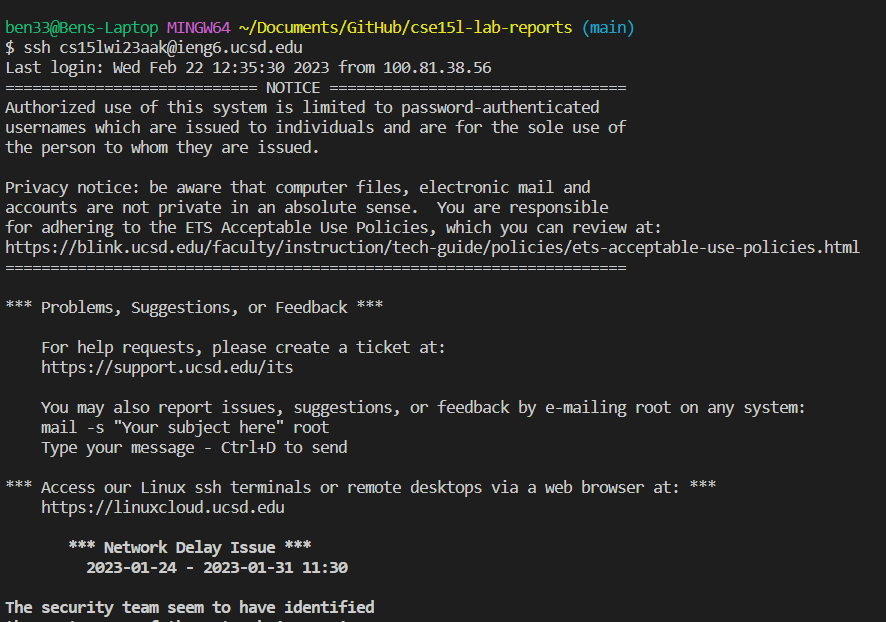
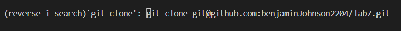
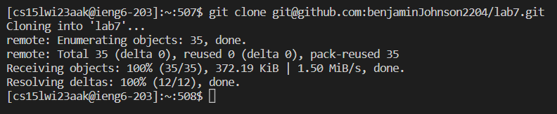
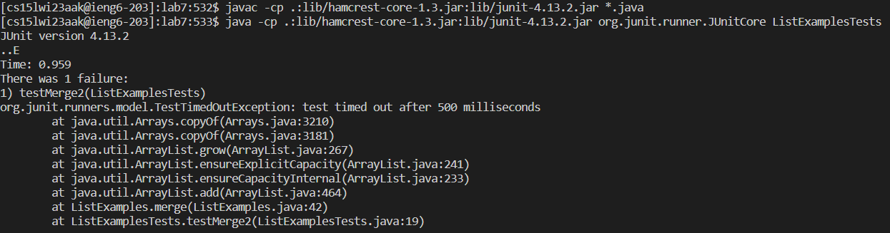
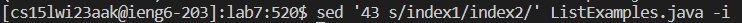
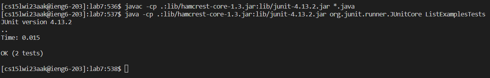
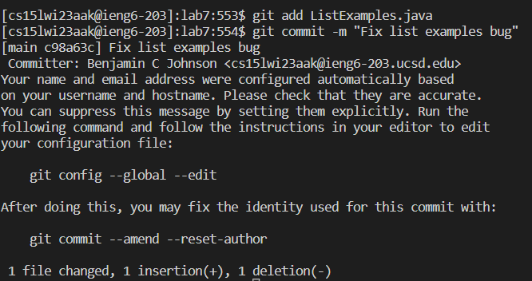
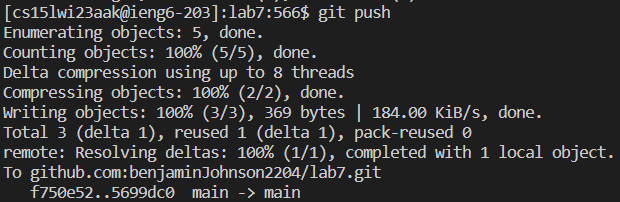

# CSE 15L Week 7 Lab Report: CSE Labs Done Quick

By Benjamin Johnson

## Introduction

This week in CSE 15L, we learned various strategies for completing tasks more efficiently from the command line. In lab, had a competition to see who could complete a series of command-line tasks the fastest. These are the tasks:

1. **Setup** Delete any existing forks of the repository you have on your account
2. **Setup** Fork the repository
3. **The real deal** Start the timer!
4. Log into ieng6
5. Clone your fork of the repository from your Github account
6. Run the tests, demonstrating that they fail
7. Edit the code file to fix the failing test
8. Run the tests, demonstrating that they now succeed
9. Commit and push the resulting change to your Github account (you can pick any commit message!)

For this lab report, our task is to write about how we completed the timed steps (4 through 9).

## 4. Log into ieng6

The command I used to log into ieng6 was `ssh cs15lwi23aak@ieng6.ucsd.edu`. The keys I pressed for this command were simply `<up><enter>` because I had already run this command from my previous attempts, and pressing the up arrow key goes back to the immediately previous command you ran. The effect of the up arrow key was filling my terminal with the `ssh` command, and the enter key ran that command.

Here is a screenshot of running this command. Notice that it didn't ask me for my password. That's because I set up SSH keys for my ieng6 account, which essentially means that I have a file with authorization to access ieng6 stored on my computer, so `ssh` can use that file to authorize me instead of requiring me to type my password.



## 5. Clone your fork of the repository from your Github account

The command I used to clone my fork of the repository is `git clone git@github.com:benjaminJohnson2204/lab7.git`. However, since I had already typed that command into the ieng6 ssh terminal during previous attempts, I could find it in my history instead of typing the whole command. The way I did that was by using Ctr + R to search my history, then typing `git clone`. So the keys I pressed were:

`<Ctrl>rgit clone<enter>`

The effect of these keys was that `<Ctrl> + r` opened a search of my history, `git clone` searched for the `git clone` command in my history, then `<enter>`ran that command.

Here are screenshots of me searching my history and then running the command:





## 6. Run the tests, demonstrating that they fail

The first command I ran was `cd lab7` to move into the newly cloned lab7 directory. After that, I had to compile and run the JUnit tests in that directory. The commands for compiling and running were `javac -cp .:lib/hamcrest-core-1.3.jar:lib/junit-4.13.2.jar *.java` and `ava -cp .:lib/hamcrest-core-1.3.jar:lib/junit-4.13.2.jar org.junit.runner.JUnitCore ListExamplesTests` respectively. To run those commands, I searched for them in my history (similar to the `git clone` command) to find where I had typed them in previous attempts. For compiling, I searched for `javac -cp`, and for running, I searched for `java -cp`. So the keys I pressed were:

Compiling:
`<Ctrl>rjavac -cp<enter>`

Running
`<Ctrl>rjava -cp<enter>`.

The effects of these keys were that `<Ctrl> + r` opened a command-line search, `javac -cp` or `java -cp` found the compile or run tests commands in my search history, and `<enter>` ran those commands.

Here is a screenshot of running these commands:



## 7. Edit the code file to fix the failing test

The reason the tests fail is that the implementation of the `merge` method in the `ListExamples` class has a bug. The bug is that when adding the remaining elements in one of two lists to the end of the resulting, merged list, the code increments the `index1` variable in both loops, but it should be incrementing `index2` in the loop for the second list in order to traverse the second list. Since `index2` is never incremented, the loop never finishes, and the test times out.

This is the relevant code:

```java
while(index1 < list1.size()) {
      result.add(list1.get(index1));
      index1 += 1;
}
while(index2 < list2.size()) {
    result.add(list2.get(index2));
    index1 += 1;
}
```

In order to fix this bug, I needed to change `index1` to `index2` on the second-to-last line of the above code snippet. One way to do this would be to use a command-line interactive editor like nano or vim, but instead, I used the `sed` command, which allows you to make a certain change to a file with one command, without having to open the file and find where you want to change.

The exact command I used to fix the bug in the file was `sed '43 s/index1/index2/' ListExamples.java -i`. The `43 s/index1/index2/` specifies what to change in the file. `43` is the line number that I want to change, `s` means to replace one string with another, and `index1/index2` means to replace `index` with `index2`. `ListExamples.java` is the path to the file to edit, and `-i` means to edit the file in-place, so that the changes are saved to disk rather than an editing copy of the file being outputted to standard out. Taken together, this means this command replaces `index1` with `index2` on line 43 of `Listexamples.java`, and saves the change.

I again used `Ctrl + r` to search my history for where I had previously run this command, so the keys I pressed were:
`<Ctrl>rsed<enter>`

The effect of these keys was that `<Ctrl> + r` opened a search of my history, `sed` found the `sed` command I had run in previous attempts, and `<enter>` ran that command, in order to edit the file and fix the bug. The effect of the command was to change `index1` to `index2` on line 43 of `ListExamples.java`.

Here is a screenshot of running this command:



## 8. Run the tests, demonstrating that they now succeed

I next had to run the same `javac` and `java` commands as step 6 to compile and run the unit tests again (technically, to compile the tests AND the code those tests are testing; although the tests themselves didn't change, `ListExamples.java` did change when I fixed the bug, which is why I have to recompile). Since I had just typed those commands, I could use the up arrow key to access them in my history. To see how many times I had to press up, let's look at my history before running `javac`:

```bash
javac -cp .:lib/hamcrest-core-1.3.jar:lib/junit-4.13.2.jar *.java
java -cp .:lib/hamcrest-core-1.3.jar:lib/junit-4.13.2.jar org.junit.runner.JUnitCore ListExamplesTests
sed '43 s/index1/index2/' ListExamples.java -i
```

As you can see, the `javac` command is 3 commands back in my history, so I need to press the up key 3 times to run it.

After running this `javac` command, my history now looks like this:

```bash
java -cp .:lib/hamcrest-core-1.3.jar:lib/junit-4.13.2.jar org.junit.runner.JUnitCore ListExamplesTests
sed '43 s/index1/index2/' ListExamples.java -i
javac -cp .:lib/hamcrest-core-1.3.jar:lib/junit-4.13.2.jar *.java
```

So now to run the tests, the `java` command is 3 commands back, so I need to press the up arrow key 3 times.

In summary, these are the keys I pressed:

Compile tests:
`<up><up><up><enter>`

Run tests:
`<up><up><up><enter>`

The effects of these keys were that the up arrow keys went back to the previous `javac` and `java` commands, respectively, in my history, and the enter key ran those commands.

Here is a screenshot of running these commands:



As you can see, the tests now pass.

## 9. Commit and push the resulting change to your Github account

I now needed to add, commit, and push the change I made to the `ListExamples.java` file. These commands were pretty short, so I just typed them out fully instead of searching my history.

The command to add my changes to git is `git add ListExamples.java`. The command to commit those changes is `git commit -m "Fix list examples bug"`. The command to push those changes is `git push`.

So to run these commands in sequence, the keys I pressed were:

`git add ListExamples.java<enter>`

`git commit -m "Fix list examples bug"<enter>`

`git push`

The effects of these keys are to type out and then run the add, commit, and push commands, which add my changes to `ListExamples.java` to git, make a commit with those changes, and then push that commit to GitHub.

Here are some screenshots of running these commands:




